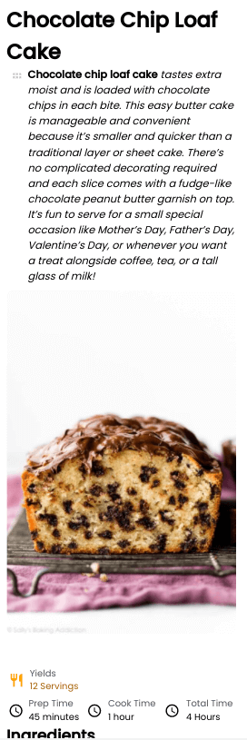
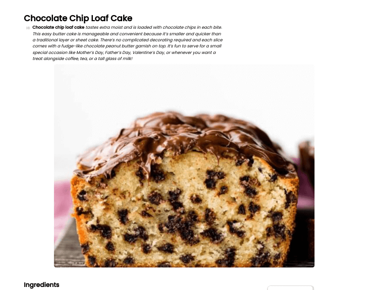
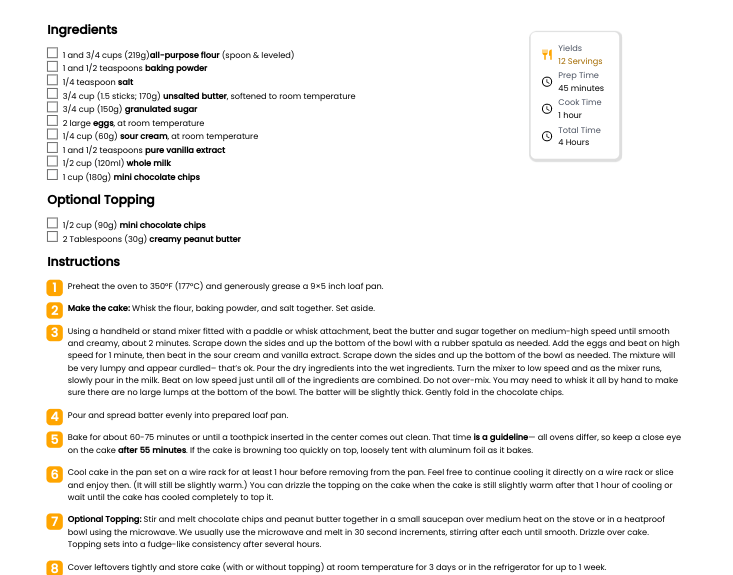

<h1 align="center">Recipe Page</h1>

   Solution for a challenge from  <a href="http://devchallenges.io" target="_blank">Devchallenges.io</a>.

  <h3>
    <a href="https://jdegand.github.io/recipe-page">
      Live Link
    </a>
     | 
    <a href="https://devchallenges.io/challenges/OEKdUZ6xs0h99C38XVht">
      Challenge
    </a>
  </h3>

## Table of Contents

- [Overview](#overview)
  - [Built With](#built-with)
- [Features](#features)
- [Useful Resources](#useful-resources)

## Overview

### Built With

- HTML
- CSS

## Features

This application/site was created as a submission to a [DevChallenges](https://devchallenges.io/challenges) challenge. The [challenge](https://devchallenges.io/challenges/OEKdUZ6xs0h99C38XVht) was to build an application to complete the following user stories:

- [x] User story: I can see a recipe with ingredients and instructions
- [x] User story: I can select a checkbox if I have the ingredients
- [x] User story: I can see the number of servings, baking times

## Useful Resources

- [Steps to replicate a design with only HTML and CSS](https://devchallenges-blogs.web.app/how-to-replicate-design/)
- [Stack Overflow](https://stackoverflow.com/questions/11946098/how-to-remove-dot-after-number-in-ordered-list-items-in-ol-li) - remove dot after number in ordered list
- [Stack Overflow](https://stackoverflow.com/questions/5945161/html-css-ordered-list-without-the-period) - ordered list without the period
- [Mail Trap](https://mailtrap.io/blog/nbsp/) - nbsp
- [MDN Docs](https://developer.mozilla.org/en-US/docs/Web/CSS/CSS_Counter_Styles/Using_CSS_counters) - CSS Counters
- [YouTube](https://www.youtube.com/watch?v=2Sf8E9CUavA) - custom checkbox
- [Blog](https://www.a11ywithlindsey.com/blog/create-custom-keyboard-accesible-checkboxes) - custom checkboxes with ally
- [Stack Overflow](https://stackoverflow.com/questions/55995977/is-there-any-good-effect-when-put-an-img-tag-in-a-p-tag-is-it-correct-at-all/55996018) - img tag inside a p tag
- [CSS Tricks](https://css-tricks.com/css-counters-custom-list-number-styling/) - css counters custom list number styling